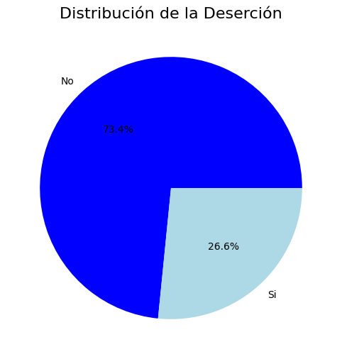
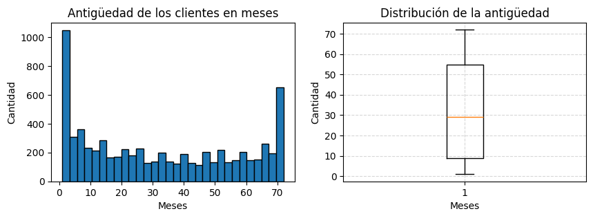
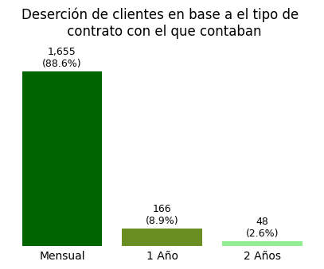

<div align="center">

# 📡 Telecom X — Análisis de cancelación de clientes

### 🔎 Parte 1 · Extracción, transformación y análisis exploratorio

[](https://www.python.org/)
[](https://pandas.pydata.org/)
[](https://numpy.org/)
[](https://seaborn.pydata.org/)
[](https://colab.research.google.com/github/MaferVelde/Telecom-X/blob/main/Telecom_X.ipynb)

**[Parte 1: análisis exploratorio](https://github.com/MaferVelde/Telecom-X)** · **[Parte 2: modelado predictivo](https://github.com/MaferVelde/Telecom-X-parte-2)**

</div>

---

## 📖 Descripción

Telecom X enfrenta una tasa relevante de cancelación de clientes (*churn*). Esta primera fase desarrolla la extracción, limpieza, transformación y exploración de los datos para identificar patrones asociados con el abandono y proponer acciones de retención basadas en evidencia.

El conjunto final contiene **7,032 clientes**; **1,869 cancelaron el servicio**, equivalente a una tasa de churn de **26.6%**.

## 🎯 Objetivos

- Extraer y normalizar los datos originales en formato JSON.
- Evaluar la calidad de los datos y corregir inconsistencias.
- Transformar variables para facilitar su análisis.
- Explorar las características de los clientes y su relación con el churn.
- Formular recomendaciones de retención.
- Preparar los datos utilizados para el modelado de la Parte 2.

## 🔄 Flujo de trabajo

1. 📥 **Extracción:** carga del JSON y normalización de estructuras anidadas.
2. 🧹 **Transformación:** revisión de tipos, valores vacíos, nombres de columnas y variables binarias.
3. 🧩 **Ingeniería de variables:** cálculo del cargo diario.
4. 📊 **Análisis exploratorio:** estudio de variables demográficas, contractuales, económicas y de servicios.
5. 🔍 **Análisis de churn:** comparación de perfiles y detección de patrones.
6. 💡 **Conclusiones:** conversión de hallazgos en recomendaciones de negocio.

## 🔑 Principales hallazgos

| Indicador | Resultado |
|---|---:|
| Clientes analizados | 7,032 |
| Clientes que cancelaron | 1,869 |
| Tasa general de churn | 26.6% |
| Contrato entre quienes cancelaron | 88.6% mensual |
| Internet entre quienes cancelaron | 69.4% fibra óptica |
| Soporte entre quienes cancelaron | 77.4% sin soporte técnico |
| Protección entre quienes cancelaron | 64.8% sin protección |
| Pago entre quienes cancelaron | 57.3% cheque electrónico |

La cancelación se concentra en clientes con **menor antigüedad**, especialmente durante los primeros meses. El género no presentó diferencias relevantes.

> Los resultados describen asociaciones observadas; no demuestran por sí solos relaciones causales.

## 📊 Visualizaciones destacadas

### 1️⃣ Distribución de la cancelación



La tasa general de cancelación alcanza el **26.6%**.

### 2️⃣ Antigüedad de los clientes



La cartera contiene tanto clientes nuevos como un grupo importante de clientes con larga permanencia.

### 3️⃣ Antigüedad y cancelación


La frecuencia de cancelación es mayor durante los primeros meses y disminuye conforme aumenta la antigüedad.

### 4️⃣ Tipo de contrato y cancelación



Los contratos mensuales concentran la mayor parte de las cancelaciones observadas.

## 💡 Recomendaciones de negocio

1. Implementar acompañamiento durante los primeros seis meses del cliente.
2. Incentivar la migración de contratos mensuales a contratos de uno o dos años.
3. Promover soporte, seguridad, respaldo y protección como servicios de valor agregado.
4. Incentivar el uso de métodos de pago automáticos.
5. Analizar la experiencia de los clientes de fibra óptica.
6. Aplicar encuestas de satisfacción y alertas tempranas a segmentos de mayor riesgo.

## 🛠️ Tecnologías y competencias

- **Python, Pandas y NumPy:** extracción, limpieza, transformación y análisis.
- **Matplotlib y Seaborn:** visualización y comunicación de resultados.
- **Google Colab:** desarrollo y ejecución reproducible.
- **Git y GitHub:** documentación y control de versiones.
- **Competencias:** ETL, calidad de datos, EDA, visualización e insights de negocio.

## 📁 Estructura del repositorio

```text
Telecom-X/
├── Graficos/               # Visualizaciones destacadas
├── TelecomX_Data.json      # Datos originales
├── Telecom_X.ipynb         # Notebook de ETL y análisis exploratorio
└── README.md               # Documentación
```

## 🚀 Cómo ejecutarlo

### ☁️ Google Colab

[](https://colab.research.google.com/github/MaferVelde/Telecom-X/blob/main/Telecom_X.ipynb)

Abre el notebook, selecciona **Conectar** y ejecuta las celdas en orden o utiliza **Entorno de ejecución → Ejecutar todas**.

### 💻 Entorno local

```bash
git clone https://github.com/MaferVelde/Telecom-X.git
cd Telecom-X
jupyter notebook Telecom_X.ipynb
```

Requiere `pandas`, `numpy`, `matplotlib` y `seaborn`.

## 🔗 Continuación

Los datos tratados se utilizan en **[Telecom X — Parte 2: predicción de churn](https://github.com/MaferVelde/Telecom-X-parte-2)**.

## 👩‍💻 Autora

**María Fernanda Velderrain Parra**<br>
Ingeniera en Biotecnología en transición hacia Ciencia de Datos

[](https://www.linkedin.com/in/maria-fernanda-velderrain-parra/)
[](https://github.com/MaferVelde)

## 🎓 Contexto académico

Proyecto desarrollado como parte del **Challenge Telecom X** de **Alura Latam**, con fines educativos y de portafolio profesional.
